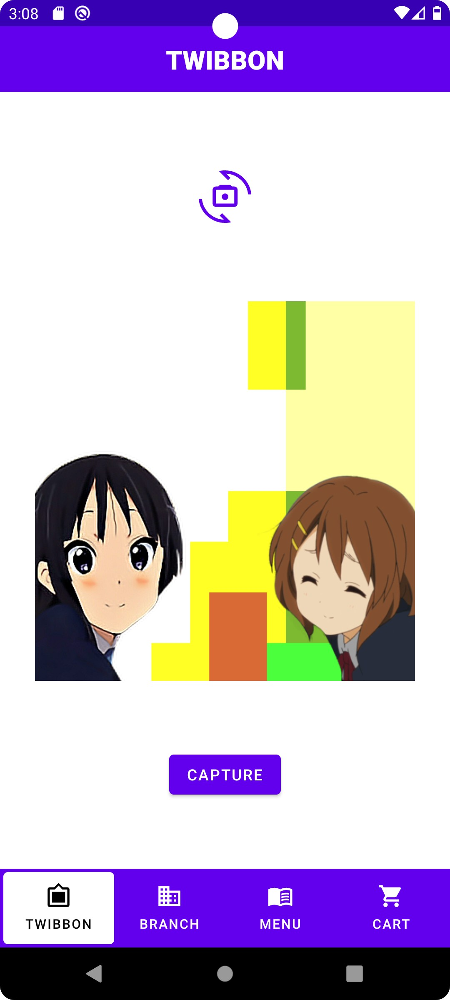
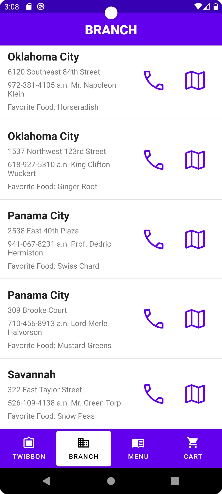
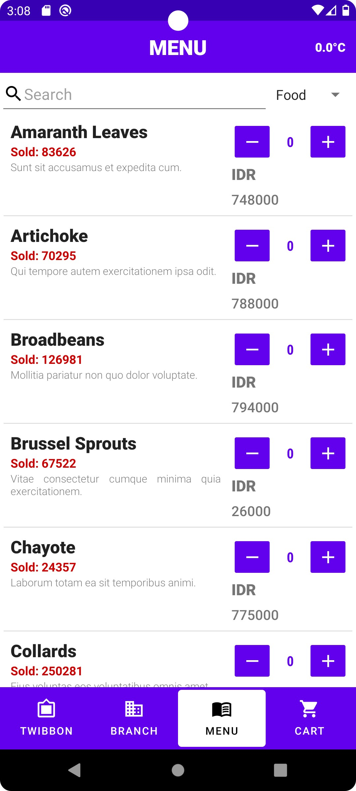
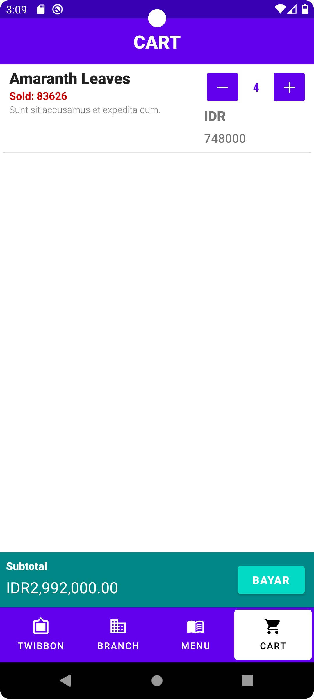
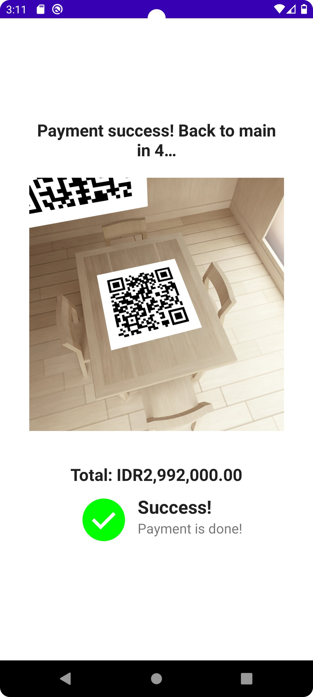
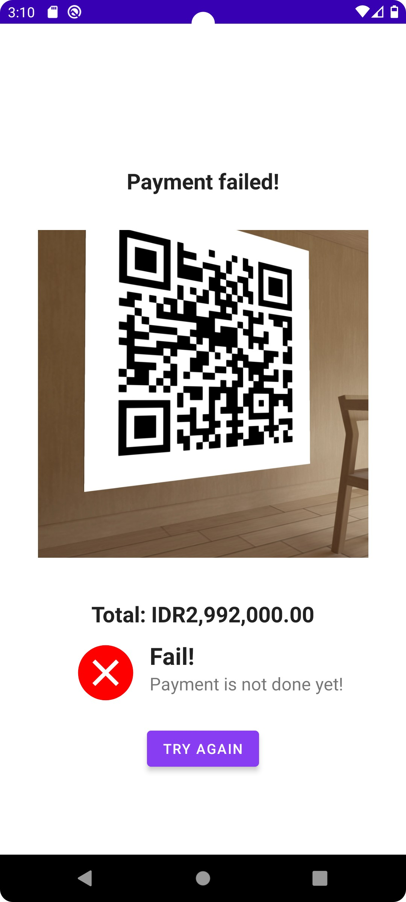

# Tugas Besar 1 IF3210 2022/2023 Android - Majika

> ## **Kelompok PAP**
> 
> Rifqi Naufal Abdjul (13520062)  
> Amar Fadil (13520103)

## Table of Contents

- [Deskripsi Aplikasi](#deskripsi-aplikasi)
- [Libraries Used](#libraries-used)
- [Features](#features)
- [Screenshots](#screenshots)
- [Pembagian Tugas](#pembagian-tugas)

## Deskripsi Aplikasi

Majika adalah aplikasi pembelian makanan atau minuman berbasis Android Native. Aplikasi ini menawarkan fitur twibbon, daftar makanan atau minuman, keranjang belanja, daftar cabang, dan pembayaran dengan QR code.

Dengan fitur-fitur yang lengkap dan mudah digunakan, Majika menjadi aplikasi yang sangat membantu pengguna dalam memenuhi kebutuhan mereka. Aplikasi ini menyediakan berbagai pilihan makanan atau minuman serta proses pembayaran yang cepat dan aman dengan menggunakan QR code. Dengan Majika, pengguna dapat menikmati pengalaman belanja makanan atau minuman yang lebih mudah dan menyenangkan.

## Libraries Used

- [ConstraintLayout](https://developer.android.com/jetpack/androidx/releases/constraintlayout)
- [SplashScreen](https://developer.android.com/reference/androidx/core/splashscreen/SplashScreen)
- [Navigation](https://developer.android.com/jetpack/androidx/releases/navigation)
- [Gson](https://github.com/google/gson)
- [Retrofit2](https://square.github.io/retrofit/)
- [Retrofit2-Converter-Gson](https://github.com/square/retrofit/tree/master/retrofit-converters/gson)
- [Room](https://developer.android.com/jetpack/androidx/releases/room)
- [CameraX](https://developer.android.com/jetpack/androidx/releases/camera)
- [MLKit-BarcodeScanning](https://developers.google.com/ml-kit/vision/barcode-scanning/android)
- [SwipeRefreshLayout](https://developer.android.com/jetpack/androidx/releases/swiperefreshlayout)

## Features

Fitur yang kami implementasi dalam program ini seperti

- Twibbon.
- Daftar Cabang.
- Daftar Makanan dan Minuman.
- Keranjang Belanja.
- Pembayaran dengan QR Code.

## Screenshots

Screenshot dapat dilihat pada [folder screenshot](./screenshot).

| Splash Screen                                   | Twibbon                              | Branch                             | Menu                            |
|-------------------------------------------------|--------------------------------------|------------------------------------|---------------------------------|
|  |  |  |  |

| Cart                           | Pembayaran Sukses                                      | Pembayaran Gagal                                     |
|--------------------------------|--------------------------------------------------------|------------------------------------------------------|
|  |  |  |

## Pembagian Tugas

|        Anggota Kelompok        |                Tugas yang Dikerjakan                |             Jumlah Jam Kerja             |
|:------------------------------:|:---------------------------------------------------:|:----------------------------------------:|
|      Rifqi Naufal Abdjul       | Header & Navbar Fitur Menu Fitur Keranjang  | Persiapan: 10 Jam Pengerjaan: 20 Jam |
|           Amar Fadil           | Fitur Twibbon Fitur Pembayaran Fitur Cabang | Persiapan: 10 Jam Pengerjaan: 20 Jam |
